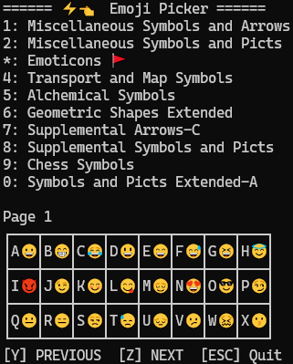

# STDOUT-EMOJI-PANEL
Ever wanted to have an emoji picker for the terminal/console?
Here it is. A fully cin/cout compatible unicode panel.

I needed this for my project [BA67](www.ba67.org).

## Main Screen
Here's a screenshot of what the main screen might look like.


You see, the number keys are for selecting unicode blocks.
That is like the city district for emojis.
In the bottom grid, you see the codepoint images for
each "citizen" of that block. When you press a key A-X,
the corresponding symbol is copied to the clipboard.

When you press Y and Z you can see more symbols in that
block.

Press the ESC key to abort the selection.

## Search Screen
If you press the `?` `question mark in the main screen,
you see the search list. Here, you can type a search phrase
and the program will provide you with a list of likely matches.

Here's what it might look like:
```
🔍 Search: heart_   👈 TYPE HERE
👉💙 : blue heart
  💕 : two hearts
  🫶 : heart hands
  💚 : green heart
  🖤 : black heart
  🤍 : white heart
  🤎 : brown heart
  ❦  : floral heart
  💜 : purple heart
  💔 : broken heart
```

## Trouble
The `heart hands` of the screach example might look broken
on your computer.

Here's what the main screen, that also might look broken:
```
====== ⚡👈  Emoji Picker ======
1: Miscellaneous Symbols and Arrows
2: Miscellaneous Symbols and Picts
*: Emoticons 🚩
4: Transport and Map Symbols
5: Alchemical Symbols
6: Geometric Shapes Extended
7: Supplemental Arrows-C
8: Supplemental Symbols and Picts
9: Chess Symbols
0: Symbols and Picts Extended-A

Page 1
┌───┬───┬───┬───┬───┬───┬───┬───┐
│A😀│B😁│C😂│D😃│E😄│F😅│G😆│H😇│
├───┼───┼───┼───┼───┼───┼───┼───┤
│I😈│J😉│K😊│L😋│M😌│N😍│O😎│P😏│
├───┼───┼───┼───┼───┼───┼───┼───┤
│Q😐│R😑│S😒│T😓│U😔│V😕│W😖│X😗│
└───┴───┴───┴───┴───┴───┴───┴───┘
[Y] PREVIOUS  [Z] NEXT  [ESC] Quit
```

Above you see, the grid might be a little bit displaced.
That's because each unicode codepoint might have a
different width on the console. In order to bypass this,
the program is able to use cursor positioning.
If, however, your situation does not allow this, there's
an option to disable that.

## Command Line Options
- `--stdin  `: use stdin and enter instead of waiting for key press
- `--nocls  `: don't use clear screen
- `--nomove `: don't use code to move the cursor
- `--start c`: start with the page that contains the next codepoint
- `--help   `: show help
